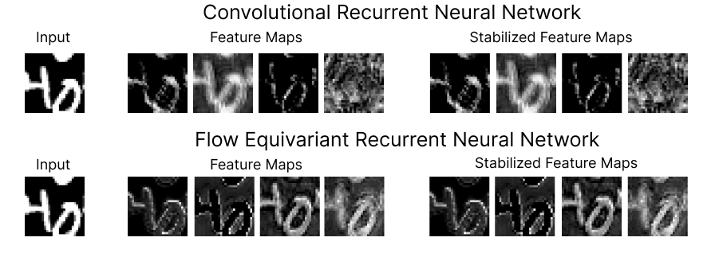

# Flow Equivariant Recurrent Neural Networks
In this repository we include the code necessary to reproduce the results from the paper: "Flow Equivariant Recurrent Neural Networks".

Preprint: https://akandykeller.github.io/papers/Flow_Equivariant_RNNs.pdf



## Dependencies
All experiments were run with python 3.12.3, with the following dependencies:
```
pytorch==2.4.0
torchvision==0.19.0
pytorch-cuda==11.8
numpy>=1.26.4
matplotlib>=3.7.0
tqdm>=4.65.0
wandb>=0.15.0
```

For the Rotating MNIST experiments the `escnn` library is also required: https://github.com/QUVA-Lab/escnn
```
escnn>=1.0.11
```

## Translating MNIST
To reproduce the Translating MNIST results of Table 1, Figure 2, and Figure 3, run the following commands for each of the respective models. The datasets will be downloaded and constructed automatically.

#### G-RNN
```bash
python moving_mnist_fp/train.py --model grnn --v_range 0 --data_v_range 2 --model_seed 123 --run_name G-RNN_V2-train
```

#### FERNN-$`V_1^T`$

```bash
python moving_mnist_fp/train.py --model fernn --v_range 1 --data_v_range 2 --model_seed 123 --run_name FERNN-V1_V2-train
```

#### FERNN-$`V_2^T`$
```bash
python moving_mnist_fp/train.py --model fernn --v_range 2 --data_v_range 2 --model_seed 123 --run_name FERNN-V2_V2-train
```

### Velocity Generalization
To reproduce the velocity generalization results from Figure 4, run the following commands:

#### G-RNN
```bash
python moving_mnist_fp/train.py --model grnn --v_range 0 --data_v_range 1 --model_seed 123 --run_velocity_generalization --run_name G-RNN_V1-train_V-gen-test
```

#### FERNN-$`V_2^T`$
```bash
python moving_mnist_fp/train.py --model fernn --v_range 2 --data_v_range 1 --model_seed 123 --run_velocity_generalization --run_name FERNN-V2_V2-train_V-gen-test
```

## Rotating MNIST

To reproduce the Rotating MNIST results of Table 1, and Figure 2, run the following commands for each of the respective models:

#### G-RNN
```bash
python rotating_mnist_fp/train.py --model grnn --v_list 0 --data_v_list -40 -30 -20 -10 0 10 20 30 40 --run_name G-RNN_V4-train
```

#### FERNN-$`V_2^R`$
```bash
python rotating_mnist_fp/train.py --model fernn --v_list -20 -10 0 10 20 --data_v_list -40 -30 -20 -10 0 10 20 30 40 --run_name FERNN-V2_V4-train
```

#### FERNN-$`V_4^R`$
```bash
python rotating_mnist_fp/train.py --model fernn --v_list -40 -30 -20 -10 0 10 20 30 40 --data_v_list -40 -30 -20 -10 0 10 20 30 40 --run_name FERNN-V4_V4-train
```

### Velocity Generalization

To reproduce the Rotating MNIST velocity generalization results of Figure 4, run the following:

#### G-RNN
```bash
python rotating_mnist_fp/train.py --model grnn --data_v_list -10 0 10 --gen_vel_list -50 -40 -30 -20 -10 0 10 20 30 40 50 --v_list 0 --run_velocity_generalization --run_name G-RNN_V1-train_V-gen-test
```

#### FERNN-$`V_4^R`$
```bash 
python rotating_mnist_fp/train.py --model fernn --v_list -40 -30 -20 -10 0 10 20 30 40 --data_v_list -10 0 10 --gen_vel_list -50 -40 -30 -20 -10 0 10 20 30 40 50 --run_velocity_generalization --run_name FERNN-V4_V1-train_V-gen-test
```


## KTH Action Recognition

To reproduce the KTH action recognition results of Table 2, run the following commands for each of the respective models. The data will be downloaded automatically. 

#### 3D-CNN
```bash
python kth/train_kth_classification.py --epochs 500 --vx_range 0 --vy_range 0 --lr 1e-3 --vx_data_range 2 --vy_data_range 2 --batch_size 32 --height 32 --width 32 --wandb --model 3dcnn --run_name 3D-CNN_V2-train
```

#### G-RNN
```bash
python kth/train_kth_classification.py --epochs 500 --vx_range 0 --vy_range 0 --lr 3e-4 --vx_data_range 2 --vy_data_range 2 --batch_size 32 --height 32 --width 32 --wandb --model grnn --run_name G-RNN_V2-train
```
#### G-RNN+
```bash
python kth/train_kth_classification.py --epochs 500 --vx_range 2 --vy_range 2 --use_fake_rnn --lr 1e-4 --vx_data_range 2 --vy_data_range 2 --batch_size 32 --height 32 --width 32 --wandb --model grnn_plus --run_name G-RNN+_V2-train
```

#### FERNN-$`V_1^T`$
```bash
python kth/train_kth_classification.py --epochs 500 --vx_range 1 --vy_range 1 --lr 3e-4 --vx_data_range 2 --vy_data_range 2 --batch_size 32 --height 32 --width 32 --wandb --model fernn --run_name FERNN-V1_V2-train
```

#### FERNN-$`V_2^T`$
```bash
python kth/train_kth_classification.py --epochs 500 --vx_range 2 --vy_range 2 --lr 3e-4 --vx_data_range 2 --vy_data_range 2 --batch_size 32 --height 32 --width 32 --wandb --model fernn --run_name FERNN-V2_V2-train
```

To reproduce the velocity generalization results of Figure 5, use the same commands as above, but with the additional flag `--v_gen_test`. Additionally, set both the `--vx_data_range` and `--vy_data_range` to `0` for the top three plots, and to `1` for the bottom three plots. 